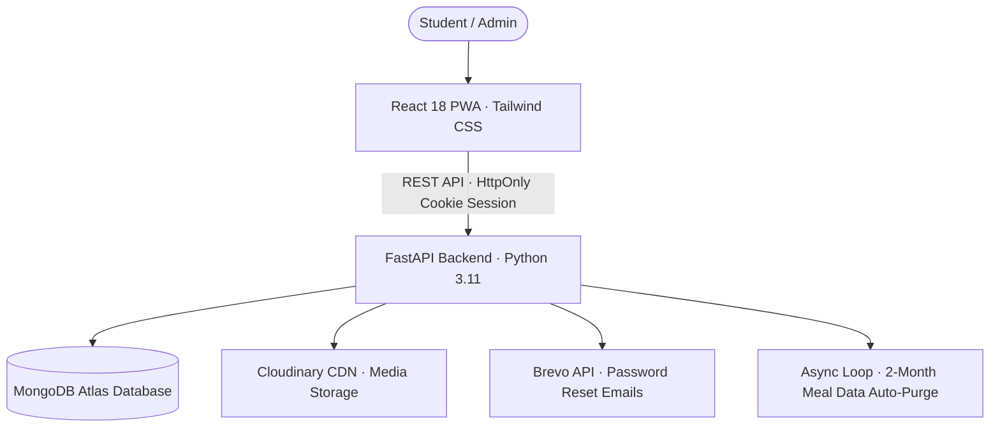

# 🍲 Ayushman Kitchen — Student Meal & Mess Management Portal

[](https://reactjs.org/)
[](https://fastapi.tiangolo.com/)
[](https://www.mongodb.com/cloud/atlas)
[](https://cloudinary.com/)
[](https://www.brevo.com/)
[](https://web.dev/progressive-web-apps/)

---

## 📖 About The Project

**Ayushman Kitchen** is a full-stack, enterprise-grade **Student Mess & Meal Management System** engineered for student hostels, PG messes, and dining facilities. 

It eliminates traditional paper mess registers, confusing attendance disputes, and manual billing by providing complete transparency to both students and mess administrators.

---

## 🚀 Key Modules & Capabilities

### 1. 🏠 Public Home & Landing Page
- **Dynamic Meal Pricing Plans**:
  - 🍽️ **Standard Plan (₹3,300 / month)**: Wholesome lunch and dinner homestyle meals daily.
  - ⭐ **Premium Plan (₹3,800 / month)**: Premium gourmet thali with customized dish selections.
- **Admin Configurable Settings**: Pricing, mess branding, and plan features are fully editable from the Admin panel without modifying code.
- **Featured Kitchen Showcase**: 4 customizable food highlight cards (Deluxe Thali, Sunday Biryani, Diet Bowls, Evening Snacks).
- **Live Moving Notice Ticker**: Marquee banner broadcasting daily specials, cutoff reminders, and kitchen announcements.

### 2. 🎓 Student Portal (`/student/login`)
- **Fast Access**: Secure sign-in via Student ID / Mobile Number & Password.
- **Daily Meal Selection**: Mark **Pure Veg**, **Non-Veg**, or **Premium Gourmet Dish** before daily cutoffs (*Lunch: 11:00 AM • Dinner: 7:00 PM*).
- **1-Click Meal Cancel / Vacation Hold**: Pause meals during holidays or leaves with automatic ledger adjustments.
- **Subscription Tracker**: Real-time counter of remaining meals (e.g. `58 / 60 meals`), payment history, and expiry alerts.
- **Security & Account Recovery**:
  - Configure recovery email directly inside student settings.
  - One-click **Forgot Password** flow with secure, single-use reset links powered by **Brevo SMTP**.
- **Student-to-Admin Direct Chat**: Two-way messaging with text, voice notes, and Hindi/English speech typing.

### 3. 🛡️ Admin & Mess Manager Workspace (`/admin/login`)
- **Live Kitchen Headcount Dashboard**:
  - Real-time tally of Lunch & Dinner plates: **Pure Veg**, **Non-Veg**, **Premium Specials**, **Cancelled / Off**, and **On Vacation**.
- **Historical Headcount & Date Selector**:
  - Switch tallies across **Today**, **Yesterday**, **2 Days Ago**, or select any **Custom Date** from the calendar.
- **Dedicated Export & Roster Downloaders**:
  - 📄 **Full Kitchen Preparation Roster (PDF & Excel/CSV)**: Complete kitchen cooking sheet for cooks and staff.
  - ❌ **Cancelled Only List (PDF & Excel/CSV)**: Download a targeted report containing *only* students who skipped or cancelled meals.
- **Student Management**: Add new students, assign Standard/Premium plans, record manual payments, renew quotas, or disable accounts.
- **Branding & Mess Controls**: Change mess name, upload logo via Cloudinary, update notice ticker, and modify meal subscription prices.

### 4. ⚙️ Automated Database Maintenance
- **2-Month Automatic Cleanup Background Task**: A built-in background loop automatically purges meal selection records older than 2 calendar months (60 days) to keep MongoDB Atlas optimized and lightning-fast.

---

## 🏗️ System Architecture



---

## 🛠️ Technology Stack

| Layer | Technology |
| :--- | :--- |
| **Frontend** | React 18, Tailwind CSS, CRACO, Radix UI, Lucide Icons, Recharts, Sonner, PWA |
| **Backend** | Python 3.11, FastAPI, Uvicorn, Motor (Async MongoDB), Pydantic v2 |
| **Database** | MongoDB Atlas (Cloud Database) |
| **Media Storage** | Cloudinary API |
| **Transactional Email** | Brevo (Sendinblue) API |
| **Timezone** | `Asia/Kolkata` (Indian Standard Time - UTC+5:30) |

---

## 📂 Project Structure

```text
ayushman-kitchen/
├── backend/
│   ├── main.py                     # Backend application entry point
│   ├── server.py                   # FastAPI routers, business logic & cleanup loop
│   ├── services/
│   │   ├── email.py                # Brevo transactional email integration
│   │   ├── photo_storage.py        # Cloudinary media storage handler
│   │   ├── timezone.py             # Asia/Kolkata timezone helpers
│   │   └── salary_slip_pdf.py      # PDF roster rendering utilities
│   └── tests/                      # Automated API test suite
├── frontend/
│   ├── src/
│   │   ├── pages/
│   │   │   ├── Landing.jsx         # Public Home page (pricing & menu showcase)
│   │   │   ├── AdminDashboard.jsx  # Admin management & kitchen roster portal
│   │   │   ├── WorkerDashboard.jsx # Student meal & attendance portal
│   │   │   ├── WorkerLogin.jsx     # Student login & forgot password modal
│   │   │   ├── AdminLogin.jsx      # Admin login portal
│   │   │   └── ResetPassword.jsx   # Token-based secure password reset
│   │   ├── components/             # Reusable UI cards, chat & modals
│   │   └── context/                # Authentication & session providers
│   └── craco.config.js             # CRA build configuration & aliases
└── README.md
```

---

## ⚙️ Environment Variables

### Backend (`backend/.env`)
```env
ENVIRONMENT=development
MONGO_URL=mongodb+srv://<username>:<password>@<cluster>.mongodb.net/?retryWrites=true&w=majority
DB_NAME=ayushman_kitchen
JWT_SECRET=your_secure_jwt_secret_key
FRONTEND_URL=http://localhost:3000
BUSINESS_TIMEZONE=Asia/Kolkata

# Media Storage (Cloudinary)
MEDIA_STORAGE=cloudinary
CLOUDINARY_URL=cloudinary://<api_key>:<api_secret>@<cloud_name>

# Email Service (Brevo)
BREVO_API_KEY=xkeysib-your_brevo_api_key
BREVO_SENDER_EMAIL=ayushmankitchen@gmail.com
BREVO_SENDER_NAME=Ayushman Kitchen
```

### Frontend (`frontend/.env`)
```env
REACT_APP_BACKEND_URL=http://localhost:8000
```

---

## 🚀 Local Setup & Installation

### 1. Clone the repository
```bash
git clone https://github.com/Nishant20361/ayushman-kitchen.git
cd ayushman-kitchen
```

### 2. Configure Backend
```bash
cd backend
python -m venv venv
source venv/bin/activate    # On Windows: venv\Scripts\activate
pip install -r requirements.txt
python -m uvicorn backend.main:app --host 127.0.0.1 --port 8000 --reload
```

### 3. Configure Frontend (in a new terminal)
```bash
cd frontend
npm install
npm start
```

Visit **`http://localhost:3000`** in your browser.

---

## 🔒 Security Standards

- **HttpOnly & SameSite Cookies**: Prevents XSS token extraction.
- **CSRF Token Validation**: Protects all sensitive mutations.
- **Cryptographic Password Resets**: Single-use tokens hashed with SHA-256 with strict 30-minute expiry.
- **Data Isolation**: Strict multi-tenant queries by `business_id`.

---

## 👥 Developers

<div align="center">

Developed with ❤️ by **Swagat and Nishant**

[](https://github.com/Nishant20361)

</div>

---

## 📄 License

This software is developed and maintained for student dining and mess management operations. All rights reserved.
# Ayushman_Kitchen
